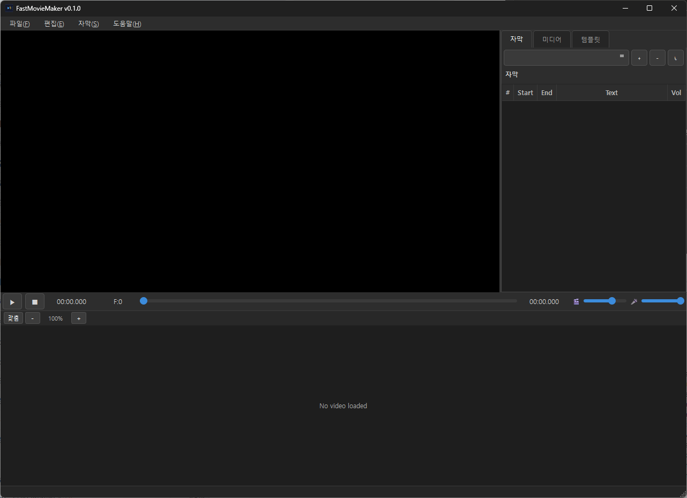

[한국어](README.md) | [English](README_EN.md)

# FastMovieMaker

> 🎬 A professional video editor supporting AI-based subtitle generation and editing.

**FastMovieMaker** is a desktop subtitle editing application equipped with advanced features such as multi-source video editing, Whisper-based automatic subtitle generation, and AI Text-to-Speech (TTS).

[](https://www.python.org/)
[](https://pypi.org/project/PySide6/)
[](tests/)
[](LICENSE)

<p align="center">
  
</p>

---

## ✨ Key Features

### 🎯 AI-Based Subtitle Generation
- **Faster-Whisper Integration** — Optimized with CTranslate2 for up to 4x faster speech recognition.
- Supports multiple Whisper models (tiny, base, small, medium, large).
- Real-time conversion progress display and cancellation support.

### 🎞️ Multi-Source Video Editing
- **Advanced Timeline** — Freely arrange clips from different video files (e.g., A→B→A pattern).
- **Filmstrip Thumbnails** — Intuitive visual editing with continuous clip thumbnails.
- Custom QPainter timeline widget for frame-by-frame precision editing.
- Seamless automatic source switching between clips.
- **GPU Accelerated Encoding** — NVENC, QSV, and AMF export acceleration support.
- **Magnetic Snap** — Auto-align when moving clips to adjacent clips and the playhead (Toggle: `S`).
- **BGM Tracks & Audio Mixing** — Independent BGM track management, trimming, magnetic snap, and volume control.
- **Timeline Markers** — Add markers with `M`, jump to markers with left-click, rename/delete via context menu (supports 5 colors). Full Undo/Redo support.

### ⚡️ Performance and Stability
- **Algorithm Optimization** — O(log n) binary search for core lookups (`segment_at`, `clip_at_timeline`).
- **NumPy Vectorized Rendering** — Python loops for timeline waveform pixels replaced with NumPy array operations.
- **Memory Optimization** — Applied `__slots__` to all dataclasses, `@lru_cache` memoization, LRU cache management.
- **HW Accelerated Media Import** — Automatic VideoToolbox(macOS)/NVENC(Windows) usage for MKV→MP4 conversion.
- **Proxy Media** — Automatic low-res proxy generation and switching for smooth editing of high-res (e.g., 4K) videos.
- **MKV Support (macOS)** — Automatic proxy conversion and playback support for MKV files on macOS.

### 🎨 Professional Video Preview
- **Asynchronous Video Loading** — Instant loading for large files (no UI freezes).
- **Video Filters** — Real-time adjustment and export application of Brightness, Contrast, and Saturation per clip.
- **Frame Cache System** — Instant scrub preview via FFmpeg frame extraction.
- **Extensive Subtitle Support** — Import support for SRT as well as SMI subtitle files.
- Customizable real-time subtitle overlays.
- Image Overlay (PIP) support with position/size adjustments.
- QSS styled dark theme UI.

### 🔊 AI Text-to-Speech (TTS)
- **Various TTS Engines:**
  - Edge-TTS (Microsoft Azure Speech)
  - ElevenLabs API Integration
- **Provider Plugin Loading**: Dynamic loading of external providers with fallback to built-in ones.
- Segment-based TTS generation and audio mixing.
- Separate volume control for video and TTS audio.
- **AI Subtitle Translation** — Automatic subtitle translation via Google/GPT engine integration.

### ✂️ Multi-Clip Selection & Editing
- **Multi-Selection** — `Ctrl+Click` to toggle individual clips, `Shift+Click` for range selection within a track.
- **Batch Deletion** — Delete all selected clips as a single macro Undo unit with the `Delete` key.
- **Copy/Paste** — `Ctrl+C`/`Ctrl+V` shortcuts and right-click context menu support.

### 🎬 Video Transitions (v0.9.5)
- **Visual Effects:** Various transitions based on `xfade` (Fade, Wipe, Slide, Dissolve, Pixelize, etc.).
- **Audio Crossfade:** Natural sound connection via `acrossfade`.
- **Auto Ripple:** Automatically move following clips when a transition length is modified (Ripple Edit).

### ✍️ Independent Text Overlays (v0.3.0)
- **Text Layers Independent of Subtitles** — Add titles, captions, watermarks separately.
- **Full Style Control** — Font, size, color, opacity, and position.
- **Interactive Drag** — Intuitively adjust text position by dragging in the player screen.
- **FFmpeg Integration** — High-quality text rendering and export via `drawtext` filter.

---

## 🚀 Installation

### Requirements
- **Python 3.13+** (3.9+ supported)
- **FFmpeg** (Required for video processing)
- **NVIDIA GPU** (Optional, for CUDA-accelerated Whisper)

### Setup
```bash
# Clone the repository
git clone https://github.com/yourusername/FastMovieMaker.git
cd FastMovieMaker

# Create a virtual environment
python -m venv .venv
.venv\Scripts\activate  # Windows
# source .venv/bin/activate  # Linux/Mac

# Install dependencies
pip install -r requirements.txt

# Install PyTorch with CUDA support (Optional, for GPU acceleration)
pip install torch torchaudio --index-url https://download.pytorch.org/whl/cu124

# Run the application
python main.py
```

### FFmpeg Installation
- **Windows:** Download from [ffmpeg.org](https://ffmpeg.org/download.html) and add to PATH.
- **Linux:** `sudo apt install ffmpeg`
- **Mac:** `brew install ffmpeg`

---

## 📝 License

MIT License - see the [LICENSE](LICENSE) file for details.
